# Centuari · Settlement Engine

The on-chain settlement worker for the Centuari decentralized lending protocol.
It consumes matched lend/borrow orders from a Redis stream, batches them, submits
them to the `Settlement` contract on Arbitrum Sepolia, and writes the resulting
positions back to PostgreSQL — idempotently and with at-least-once delivery
semantics.

This is one of nine services in the Centuari system. For the big picture, see the
[umbrella README](https://github.com/centuari-labs/centuari).

---

## What this service does

- **Consumes matches** from the Redis stream `settlement:matches` (produced by
  the [matching engine](https://github.com/centuari-labs/matching-engine)) using
  a consumer group with pending-entry recovery.
- **Batches** matches by size *or* time, whichever fires first.
- **Filters** already-settled matches with a single multicall before submitting.
- **Settles on-chain** via Viem (`Settlement.settleMatches()`), with nonce
  management, client caching, and retryable/non-retryable error classification.
- **Writes back** lend/borrow positions and bond tokens, flips
  `matches.settlement_status` PENDING → SETTLED, and releases order locks
  (`user_balance.in_orders` decrement) — all stamped for idempotency.

## Tech stack

Node.js · TypeScript (strict) · Viem · ioredis (Streams + Consumer Groups) ·
PostgreSQL (raw `pg`) · Zod · Pino · Jest 29 · pnpm

## Processing pipeline

```mermaid
flowchart TD
    ME[Matching Engine] -->|XADD| STREAM[(Redis stream<br/>settlement:matches)]
    STREAM -->|XREADGROUP| CONS[Consumer + recovery]
    CONS --> ZOD[Zod validate]
    ZOD --> ACC[BatchAccumulator<br/>size OR time trigger]
    ACC --> FILTER[Filter settled<br/>multicall isSettled]
    FILTER --> TX[settleMatches&#40;&#41;<br/>Viem on-chain tx]
    TX --> EVT[Parse events]
    EVT --> PERSIST[Persist positions + bonds<br/>applyOnChainEffect]
    PERSIST --> WB[Writeback:<br/>matches → SETTLED<br/>release in_orders lock]
    WB --> ACK[XACK + XDEL]
    PERSIST --> PG[(PostgreSQL)]
    WB --> PG
    TX --> CHAIN[Arbitrum Sepolia]
```



## Batch strategy

Two triggers, whichever fires first:

1. **Size** — queue reaches `SETTLEMENT_BATCH_SIZE` (default 10).
2. **Time** — `SETTLEMENT_BATCH_INTERVAL_MS` elapses with ≥ 1 match (default 5000ms).

Backpressure caps the queue at `batchSize × 5`; duplicates are dropped via a
`seenIds` set. The poll loop uses exponential backoff
(`min(baseMs × 2^(failures-1), maxBackoffMs)`) for both contract and DB retries.

## Settlement writeback & lock release

After `Settlement.settle()` confirms on-chain, three writebacks run in order:

1. **Position rows** via per-event `applyOnChainEffect` — the upsert SQL comes
   from the shared
   [`@centuari-labs/on-chain-effects`](https://github.com/centuari-labs/on-chain-effects)
   mutation functions, so it is identical *by construction* to the indexer tail
   and cannot drift.
2. **Collateral-flag cleanup** — DELETE `pending_collateral_flags` rows matching
   the receipt's `CollateralFlagSet` events.
3. **Lock release** — for each settled match, a fresh transaction flips
   `matches.settlement_status` PENDING → SETTLED and decrements
   `user_balance.in_orders` for both sides by the exact decomposition the
   matching engine's db-writer added at match time.

The conditional `UPDATE … WHERE settlement_status = 'PENDING'` returns 0 rows on
retry, so the `in_orders` decrements fire exactly once;
`GREATEST(in_orders − decrement, 0)` guards against underflow. Each match's
writeback is its own transaction, so a partial failure doesn't block the rest of
the batch — settlement is already final on-chain, so retries are safe.

## Project layout

```
src/
├── index.ts                       # startup, shutdown, consumer-group init
├── config.ts                      # Zod-validated config (17 env vars)
├── logger.ts                      # structured pino logger
├── schemas/match.ts               # match Zod schema + stream constants
├── redis/                         # client + stream consumer (recovery via XCLAIM)
└── settlement/
    ├── batchAccumulator.ts        # hybrid size/time batching
    ├── batchProcessor.ts          # poll loop with backoff
    ├── processBatch.ts            # filter → settle → persist → ack
    ├── smartContract.ts           # Viem clients, multicall, error mapping
    ├── nonceManager.ts            # tx nonce management
    └── database/                  # connection, apply-settlement, lock-release, ...
```

## Getting started

```bash
# from the umbrella repo: bring up infra first
docker-compose up -d postgres redis nats

pnpm install
pnpm run dev          # ts-node-dev --respawn --transpile-only
```

Configure via `.env` (see `.env.example`): `REDIS_URL`, `DATABASE_URL`,
`RPC_URL`, `SETTLEMENT_PRIVATE_KEY`, `SETTLEMENT_CONTRACT_ADDRESS`, plus the
batch tuning vars above. Contract address/ABI are synced from the smart-contract
repo's `bin/sync-to-services.sh`.

## Commands

```bash
pnpm run dev                # watch mode
pnpm run build              # tsc
pnpm run start              # node dist/index.js
pnpm run test               # jest (all)
pnpm run test:unit          # unit only
pnpm run test:integration   # integration (real Redis + Postgres)
pnpm run test:coverage      # with coverage (80% threshold)
```

## Conventions

- **Single responsibility per file**; database layer never makes RPC calls
  (those live in `smartContract.ts`).
- **Retryable vs non-retryable** errors are always distinguished via
  `BatchProcessingError { retryable }`.
- **Idempotent by upsert** — a match arriving twice never creates duplicate rows.
- **Multicall** for batched `isSettled` checks; Viem clients cached by
  `chainId|rpcUrl`.
- **Graceful shutdown** (SIGTERM/SIGINT): stop polling, finish the current batch,
  close connections. **No floating promises.** Structured logging only.

All services run with `TZ=UTC`; all timestamp columns are `TIMESTAMPTZ`.
